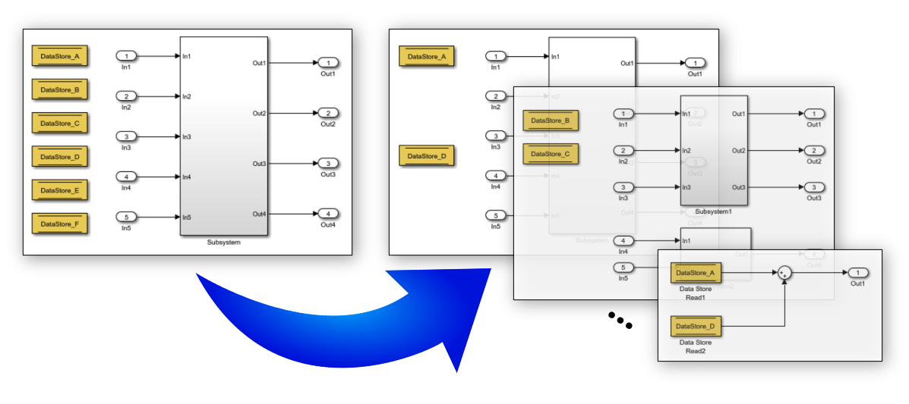

# Data Store Rescope Tool

Data stores in Simulink are analogous to variables in traditional programming languages. Therefore, they should be restricted in scope to avoid inadvertent/unwanted access, hide low-level details, and reduce the number of inputs for testing.

The Data Store Rescope Tool (formerly known as the Data Store Push-Down Tool) identifies the data stores that have scopes larger than necessary. Then, the declaration (Data Store Memory block) of each identified data store is pushed down the model hierarchy to the lowest level possible, such that all the references to the data store memory are still within its scope. Also, if references to a data store are outside of its scope, the Data Store Rescope Tool can be used for auto-correction: the data store’s declaration is first moved to the model's top level, and then pushed-down to minimize data store's scope as previously described.

## User Guide
For installation and other information, please see the [User Guide](doc/DataStoreRescope_UserGuide.pdf).

This tool is also available for download on the [Matlab Central File Exchange](https://www.mathworks.com/matlabcentral/fileexchange/51160-data-store-rescope-tool).

